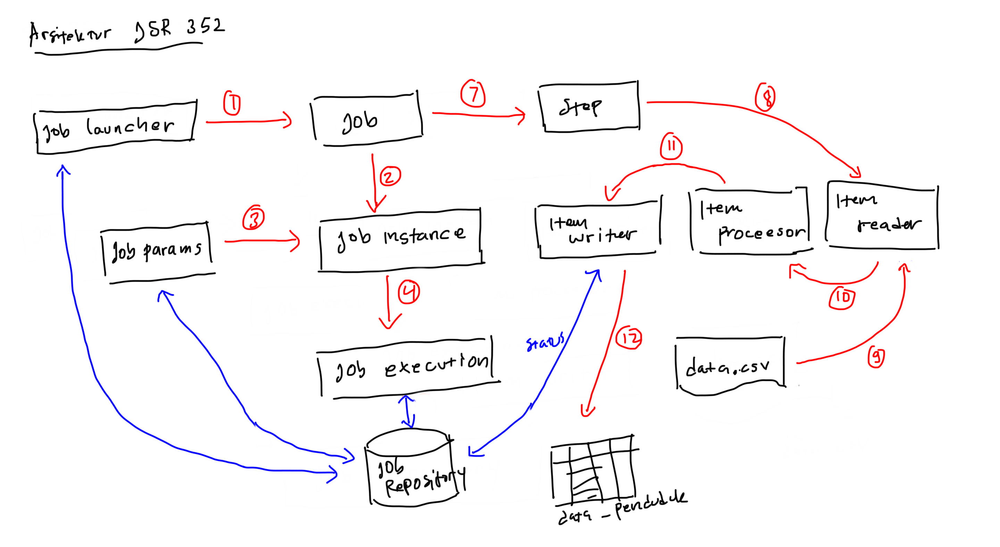
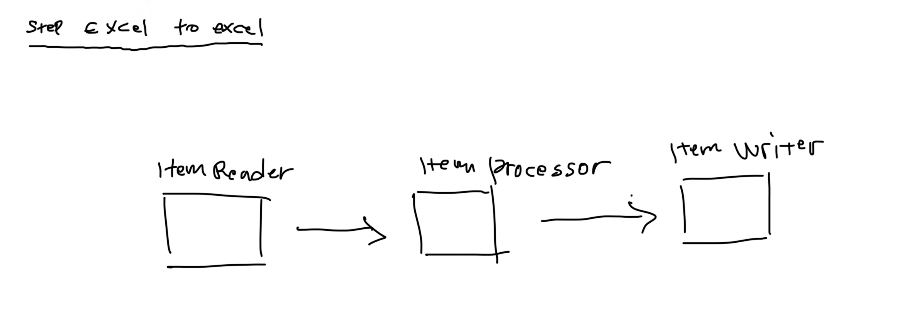
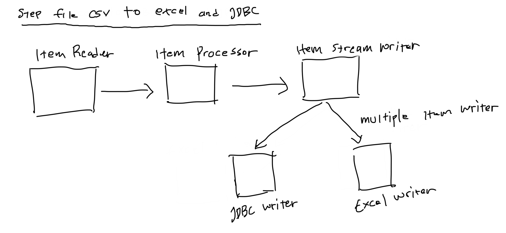

# Belajar jsr 352 

Batch proccession based on JSR 352 dengan Spring Batch.

## Arsitektur spring-batch: 



## Flow spring-batch

1. Job Launcher
2. Job -> Job Instance -> Job execution
3. Step 
	- Item Reader
	- Item Proccessor
	- Item Writer

## Setup / System Requirement

- PostgreSQL
- Maven
- Docker (Optional)

## Configuration

- Database PostgreSQL
    - user: `postgres`
    - password: `admin`
    - url: `jdbc:postgresql://localhost:5432/postgres`
- Database on Docker

```docker
docker-compose up -d
```

## Flow step single processing



## Flow step multiple processing item writer


